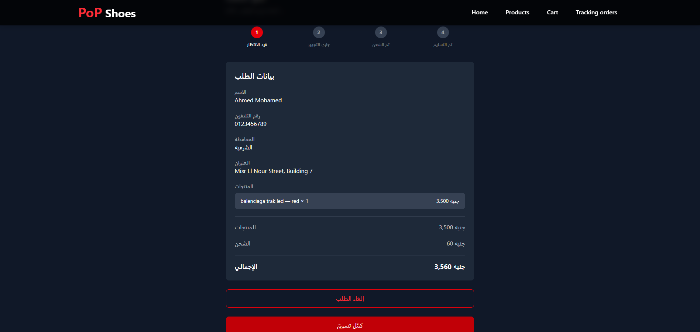
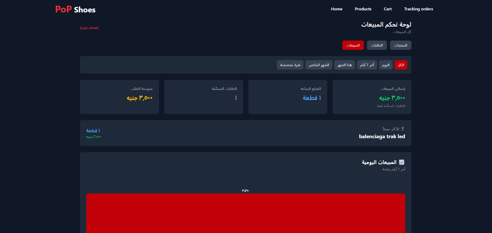

# 👟 PoP Shoes — E-Commerce Platform

A full-stack e-commerce platform for selling shoes, built with React and Supabase.

The application includes a complete customer shopping experience and an admin dashboard for managing products, inventory, orders, and sales.

## 🚀 Live Demo

**[View Live Demo](https://pop-shoes.vercel.app/)**

## 📸 Screenshots

### Customer Experience


### Shopping & Orders




### Admin Dashboard




## ✨ Features

### 🛍️ Customer

* Browse products and categories
* Product variants by size and color
* Variant-specific stock management
* Product search and filtering
* Shopping cart
* Guest checkout
* Order creation and tracking
* Order history
* Order cancellation
* Responsive design

### 🔐 Authentication

* Supabase Authentication
* Customer accounts
* Protected admin routes
* Role-based access control

### 🧑‍💼 Admin Dashboard

* Product management
* Category management
* Product variant management
* Inventory management
* Order management
* Order status updates
* Sales statistics
* Low-stock monitoring
* Image upload and management

## 🛡️ Security & Business Logic

The application uses Supabase PostgreSQL and Row Level Security (RLS) to protect application data.

Key protections include:

* Users can access only their own orders.
* Admin functionality is protected by role-based authorization.
* Database policies restrict unauthorized data access.
* Product prices are validated server-side.
* Stock availability is validated during order creation.
* Inventory updates are performed atomically.
* Order cancellation can restore inventory.
* Database-level logic helps prevent overselling under concurrent requests.

## 🧰 Tech Stack

### Frontend

* React
* JavaScript
* Vite
* Tailwind CSS
* React Router

### Backend & Database

* Supabase
* PostgreSQL
* Supabase Auth
* Supabase Storage
* Row Level Security (RLS)
* PostgreSQL Functions

### Development & Deployment

* Git
* GitHub
* Vercel
* VS Code

## 🏗️ Application Flow

```text
Customer
   │
   ├── Browse Products
   │
   ├── Select Variant
   │
   ├── Add to Cart
   │
   ├── Checkout
   │
   └── Track Orders
           │
           ▼
      Supabase
           │
     ┌─────┴─────┐
     │           │
 PostgreSQL    Storage
     │
     ├── Products
     ├── Variants
     ├── Orders
     ├── Order Items
     └── Users
           │
           ▼
     Admin Dashboard
```

## 📂 Main Application Areas

```text
src/
├── components/
├── pages/
├── layouts/
├── lib/
├── hooks/
└── ...
```

The application separates customer-facing features from protected administrative functionality.

## ⚙️ Getting Started

### 1. Clone the repository

```bash
git clone https://github.com/Ahmed-M00hamed/PoP-Shoes.git

cd PoP-Shoes
```

### 2. Install dependencies

```bash
npm install
```

### 3. Configure environment variables

Create a `.env.local` file:

```env
VITE_SUPABASE_URL=your_supabase_url
VITE_SUPABASE_ANON_KEY=your_supabase_anon_key
```

Never commit real credentials or service-role keys to the repository.

### 4. Start the development server

```bash
npm run dev
```

The application will be available at:

```text
http://localhost:5173
```

## 🎯 What I Built

This project was built to practice and demonstrate real-world application development rather than a static UI.

It covers:

* React application architecture
* State and data management
* Authentication and authorization
* Relational database design
* Secure database access with RLS
* Inventory and order workflows
* Admin dashboards
* Responsive UI development
* Deployment and production configuration

## 👨‍💻 Author

**Ahmed Mohamed**

Junior React / Frontend Developer

* GitHub: https://github.com/Ahmed-M00hamed
* Live Demo: https://pop-shoes.vercel.app/
