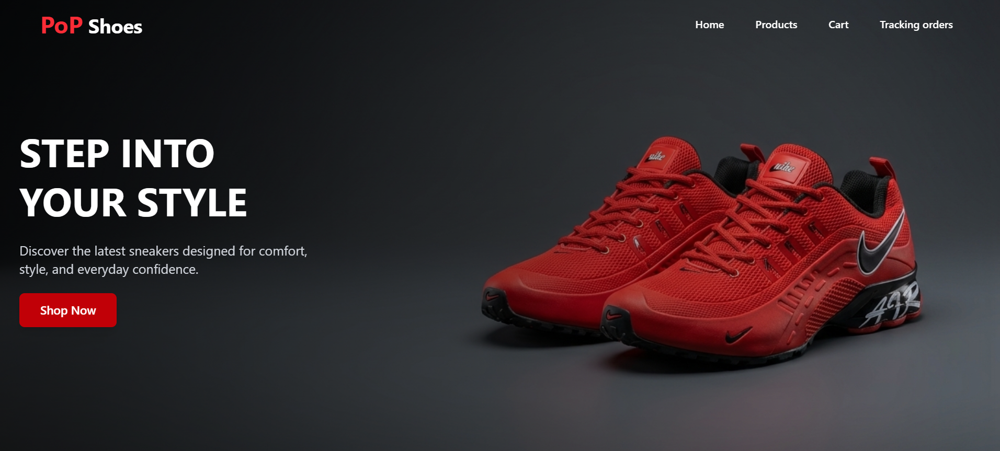
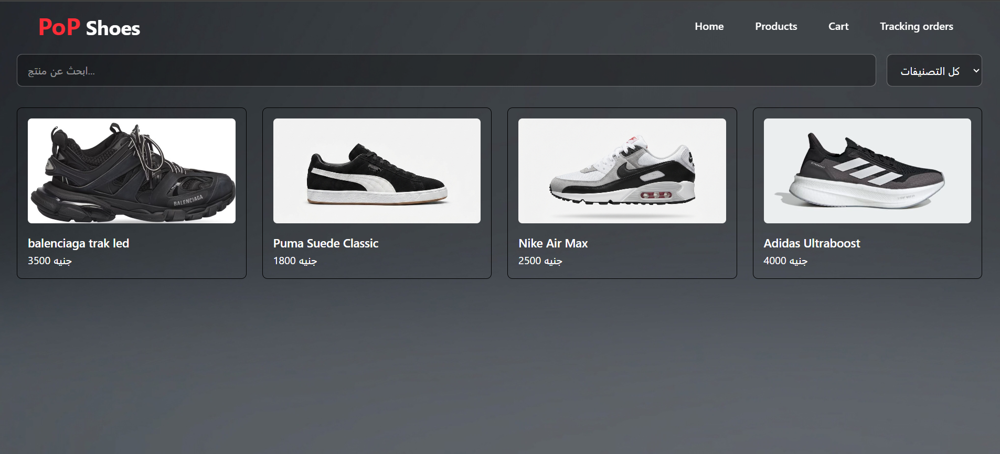
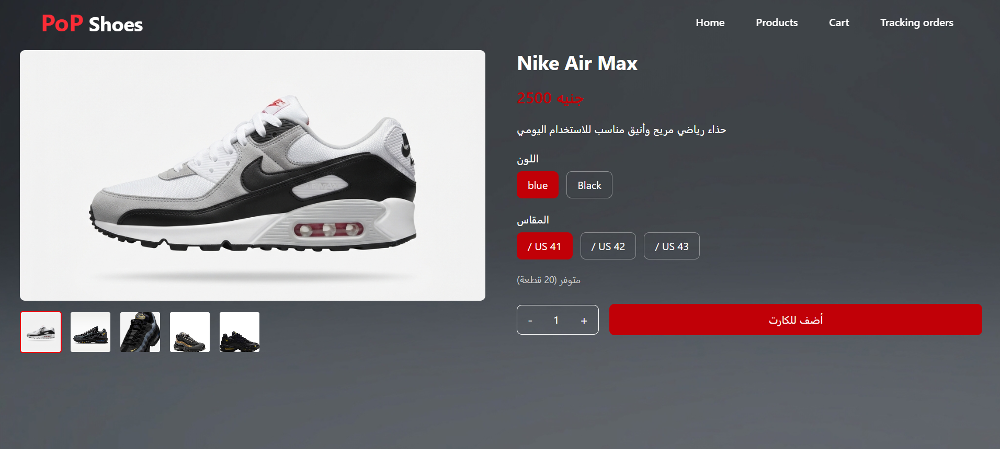
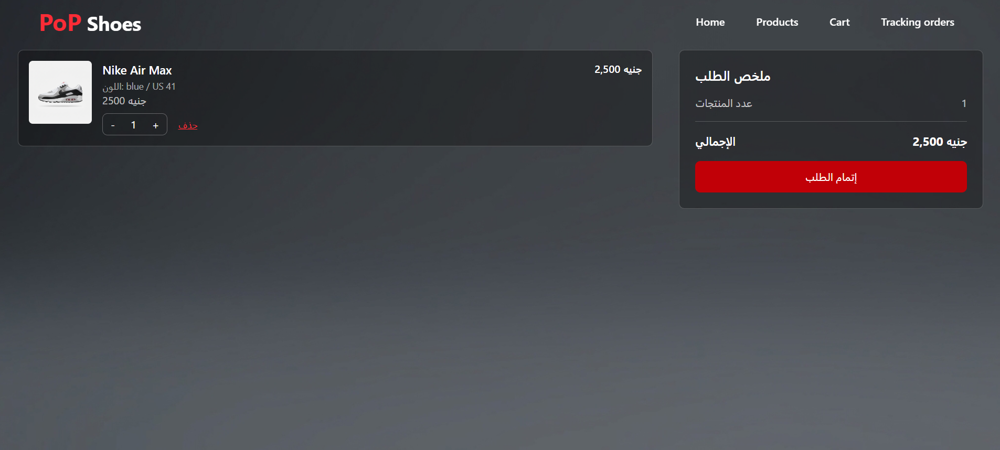
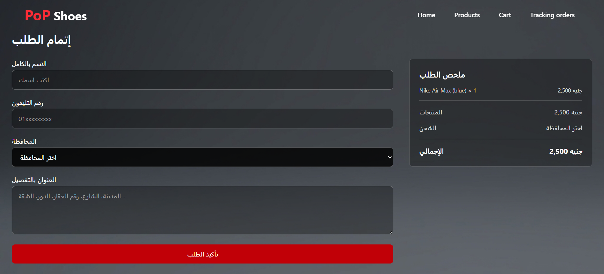
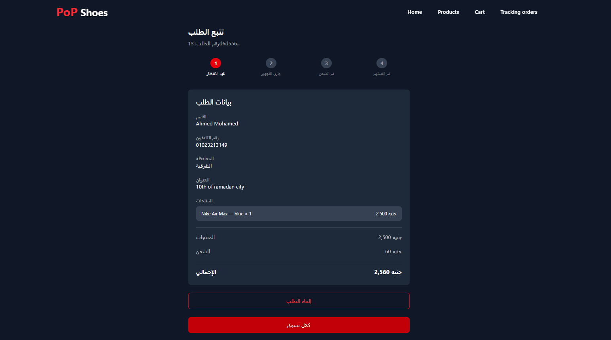
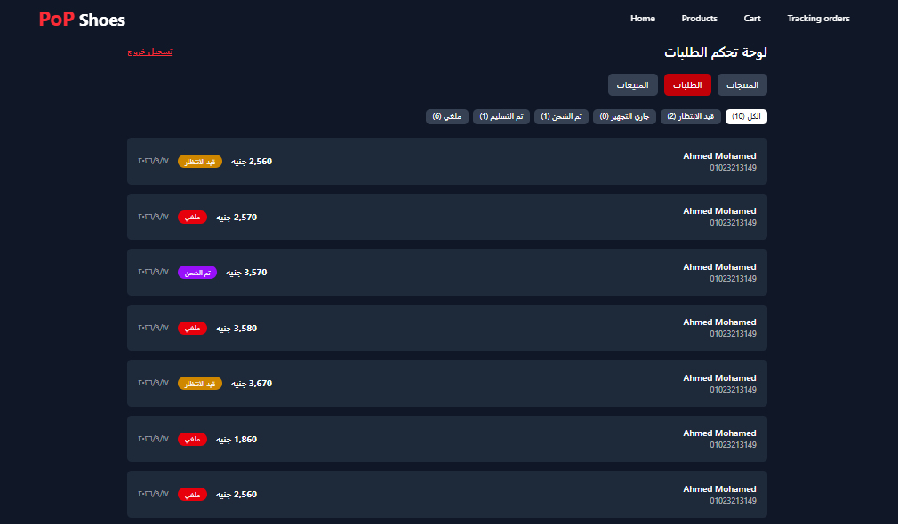
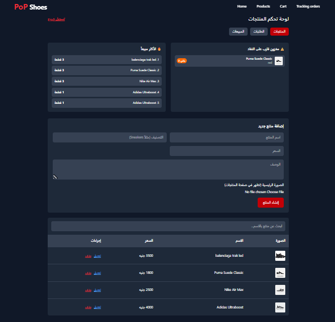
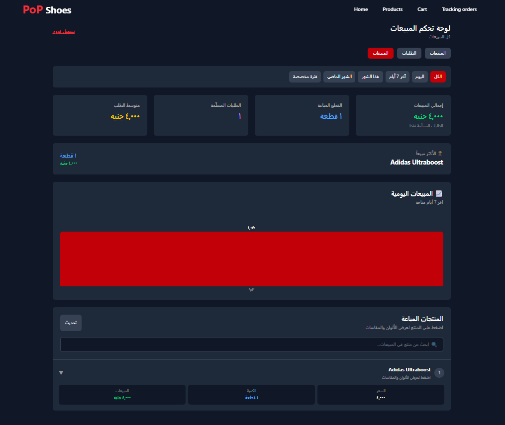

# 👟 PoP Shoes

A full-stack sneaker e-commerce platform built with **React, Vite, Tailwind CSS, and Supabase**.

PoP Shoes provides a complete shopping experience for customers and a secure admin dashboard for managing products, variants, inventory, orders, and sales.

## 🚀 Live Demo

**[View Live Demo](https://pop-shoes.vercel.app/)**

## ✨ Features

### 🛍️ Customer Experience

- Browse and search products
- Product details with color and size selection
- Color-specific product image galleries
- Variant-level inventory management
- Guest shopping cart using anonymous authentication
- Responsive cart and checkout flow
- Governorate-based shipping calculation
- Secure order creation
- Order confirmation and tracking
- "My Orders" page for previous orders
- Order cancellation with cancellation reasons
- Automatic low-stock indicators
- Fully responsive design for desktop and mobile

### 👨‍💼 Admin Dashboard

- Secure admin authentication with Supabase Auth
- Create, edit, and delete products
- Manage product colors and sizes
- Manage independent stock for each variant
- Upload primary and gallery product images
- Manage customer orders
- Update order statuses
- View low-stock products
- View best-selling products
- Sales dashboard with date filtering
- Product-level sales statistics

### 🔐 Security & Data Integrity

- Row Level Security (RLS) enabled on protected database tables
- Customers can only access their own orders
- Admin operations are restricted to authorized users
- Order creation is handled through secure database functions
- Product prices and shipping costs are validated server-side
- Stock is checked and updated atomically
- Overselling is prevented using database-level row locking
- Order cancellation restores the purchased stock
- Anonymous customers cannot access other customers' orders

## 🧪 Tested Order Flow

The main e-commerce flow has been manually tested through real customer scenarios, including:

- Normal order creation
- Inventory deduction
- Insufficient-stock protection
- Overselling prevention across multiple devices
- Customer order isolation
- Order cancellation
- Stock restoration after cancellation
- Shipping and delivery status flow
- Cancellation restrictions after shipping

## 🛠️ Tech Stack

| Technology       | Purpose                                                              |
| ---------------- | -------------------------------------------------------------------- |
| **React**        | Frontend UI                                                          |
| **Vite**         | Development and production build tool                                |
| **React Router** | Client-side routing                                                  |
| **Tailwind CSS** | Styling and responsive UI                                            |
| **Supabase**     | PostgreSQL database, authentication, storage, and database functions |
| **Vercel**       | Deployment and hosting                                               |
| **Git & GitHub** | Version control                                                      |

## 📁 Project Structure

```text
src/
├── components/          # Shared UI components
├── pages/               # Customer and admin pages
├── utils/               # Helper functions and utilities
├── supabaseClient.js    # Supabase client configuration
└── App.jsx              # Application routes

public/
└── products/            # Product images
```

## ⚙️ Local Setup

### 1. Clone the repository

```bash
git clone https://github.com/Ahmed-M00hamed/PoP-Shoes.git
cd PoP-Shoes
```

### 2. Install dependencies

```bash
npm install
```

### 3. Configure environment variables

Create a `.env` file in the project root:

```env
VITE_SUPABASE_URL=your_supabase_project_url
VITE_SUPABASE_ANON_KEY=your_supabase_anon_key
```

> `.env` is excluded through `.gitignore` and should never be committed to the repository.

### 4. Configure Supabase

The application requires:

- Supabase Authentication
- Anonymous Sign-Ins
- PostgreSQL database
- Row Level Security policies
- `product-images` Storage bucket
- Admin user account

The database schema and security configuration should be recreated in the target Supabase project before running the application.

### 5. Start the development server

```bash
npm run dev
```

The application will be available at:

```text
http://localhost:5173
```

## 🔐 Admin Dashboard

Admin login:

```text
/admin/login
```

After authentication, authorized administrators can access:

```text
/admin
/admin/orders
/admin/sales
```

Admin access is protected by database-level authorization rather than relying only on frontend route protection.

## 🚀 Deployment

PoP Shoes can be deployed using Vercel.

### Build

```bash
npm run build
```

### Output directory

```text
dist
```

### Environment Variables

Add the following variables to the Vercel project:

```env
VITE_SUPABASE_URL
VITE_SUPABASE_ANON_KEY
```

After deployment, verify:

- Customer authentication
- Product loading
- Cart functionality
- Checkout
- Order creation
- Order tracking
- Admin authentication
- Product management
- Image uploads
- Order management

## 📸 Screenshots

### Home Page



### products



### Product Details



### Shopping Cart



### Checkout



### Order Tracking



### Order Management



### Product Management



### Sales Dashboard



## 💡 Project Highlights

This project was built as a complete e-commerce application rather than a static frontend.

The main focus was implementing the business logic behind:

- Variant-level inventory
- Secure guest checkout
- Server-side order validation
- Atomic stock updates
- Order ownership
- Cancellation and stock restoration
- Admin authorization
- Product image management
- Sales reporting

## 📌 Future Improvements

Possible future improvements include:

- Online payment integration
- Customer notifications through WhatsApp or email
- Coupon and discount system
- Advanced analytics
- Customer accounts and profile management
- Product reviews and ratings
- Automated image optimization
- Order notification system

## 📄 License

This project is intended for portfolio, educational, and private commercial use.
